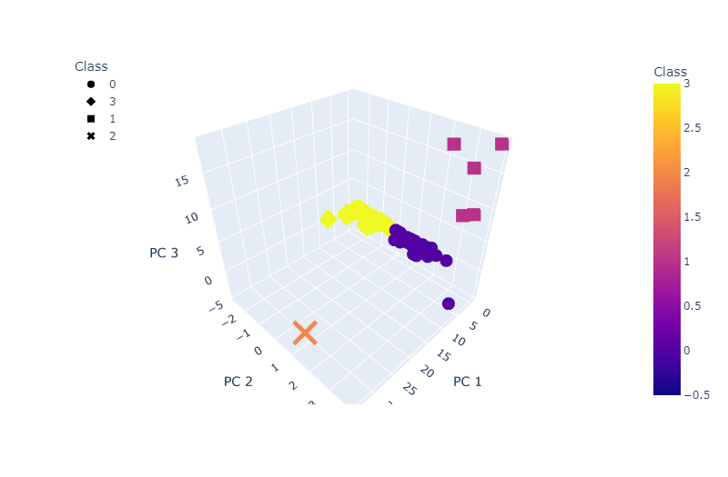

# Cryptocurrencies
<!-- Analyzing cryptocurrencies using unsupervised machine learning -->
## Project Overview
Accountability Accounting has requested a report that includes what cryptocurrencies are on the trading market and how they could be grouped to create a classification system for this new investment.  The analysis methodology follows:
1. Preprocessing the data for PCA
2. Reducing data dimensions using PCA
3. Clustering cryptocurrencies using K-means
4. Generating visualizations

## Purpose
This project is to analyze cryptocurrencies trends using unsupervised machine learning, PCA algorithm and K-Means clustering.

## Resources
### Data Sources & Bespoke Code
1. [crypto_data.csv](Resources/crypto_data.csv) [^1]
2. [crypto_clustering.ipynb](crypto_clustering.ipynb) [^2]

[^1]: CryptoCompare Data. [https://min-api.cryptocompare.com/data/all/coinlist](https://min-api.cryptocompare.com/data/all/coinlist)  
[^2]: Jupyter Notebook

### Software & CDNs
***Table 1: Software & Library Versions***
| Software | Version |
| :--- | :---: |
| Python | 3.7.13 |
| Pandas | 1.3.5 |
| hvplot | 0.7.3 |
| plotly | 5.6.0 |
| SciPy | 1.7.3 |
| Scikit-learn | 1.0.2 |
| Visual Studio Code | 1.70.2 |

# Results
From the analysis, there are 532 tradable cryptocurrencies.

***Figure 1: K-Means Clusters***

